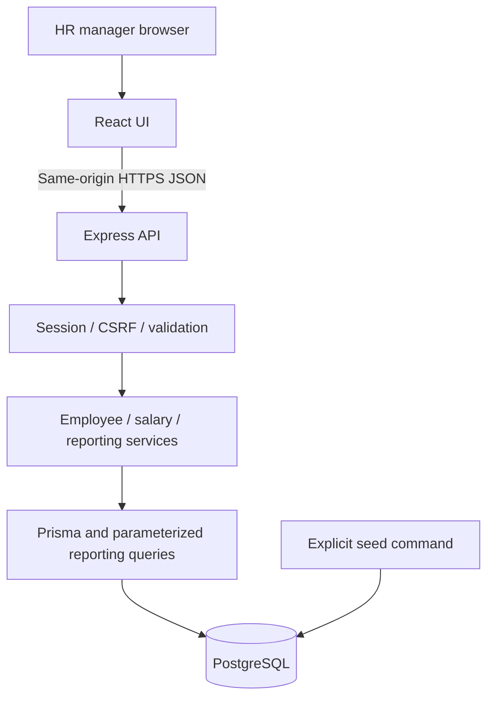
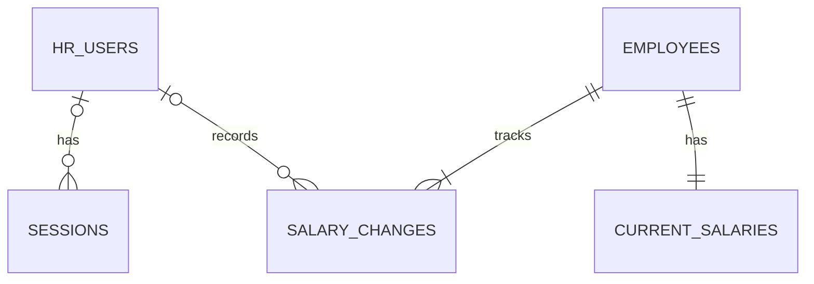

# ACME Salary Management — Architecture

**Date:** 2026-09-28 · **Status:** Intended architecture; Tasks 1–3 now implemented to their respective scope. See project memory for current feature status.

This document describes the intended implementation of [the requirements](requirements.md). [PROJECT_MEMORY.md](../PROJECT_MEMORY.md) records actual feature status, approvals, and history. [API contracts](api-contracts.md) define the initial HTTP interface. Approval to write these documents is not approval to implement later tasks.

## Application boundaries

Use a modular monolith: one Node.js/TypeScript API, one React/TypeScript HR interface, and one PostgreSQL database. A separate customer website is out of scope. Ten thousand employees can be handled with indexed relational queries and database pagination; distributed services and a separate cache are unnecessary initially.



The production Node service serves the built React assets and `/api/v1` routes. Development uses a frontend proxy to the API. A managed PostgreSQL database stores persistent data independently of application restarts. Hosting provider and dependency versions will be selected and verified during their respective tasks.

## Technology decisions

| Area         | Proposed choice                                      | Reason / trade-off                                                                                                                   |
| ------------ | ---------------------------------------------------- | ------------------------------------------------------------------------------------------------------------------------------------ |
| Backend      | Node.js, TypeScript, Express                         | Small HTTP layer; keep business rules independently testable                                                                         |
| Frontend     | React, TypeScript, Vite                              | Client-rendered internal tool; server rendering is unnecessary                                                                       |
| UI           | Material UI                                          | Consistent accessible form and table primitives; verify final keyboard behavior                                                      |
| Remote state | TanStack Query                                       | Fetching, loading/error states, and invalidation after salary changes                                                                |
| Validation   | Zod in a shared contracts package                    | Reuse input rules; server remains authoritative                                                                                      |
| Storage      | PostgreSQL and Prisma migrations                     | Exact decimals, relational constraints, transactions, and typed access; more setup than SQLite but a natural managed-deployment path |
| Tests        | Vitest, React Testing Library, Supertest, Playwright | Unit, component, API integration, and a small set of browser journeys                                                                |

Keep database models private to the server. Explicit response DTOs prevent accidental exposure of hashes, sessions, or internal fields. Avoid generic repositories or dependency-injection frameworks until a concrete need appears.

## Intended repository layout

```text
apps/
  api/src/
    modules/{auth,employees,salaries,reports}/
    middleware/
    db/
    app.ts
    server.ts
  web/src/
    features/{auth,employees,salaries,reports}/
    components/
    lib/
packages/contracts/src/
prisma/
  schema.prisma
  migrations/
  seed.ts
docs/
  requirements.md
  architecture.md
  api-contracts.md
PROJECT_MEMORY.md
```

Each API module separates HTTP handlers, service logic, and database queries where needed. Salary arithmetic uses decimal operations rather than JavaScript floating-point arithmetic. The frontend formats decimal strings without altering the persisted amount.

## Relational model

All entity IDs are UUIDs, timestamps are UTC `timestamptz`, and foreign keys use restrictive deletion behavior. No delete endpoints are planned.

| Table              | Important fields and constraints                                                                                                                                                                                                           |
| ------------------ | ------------------------------------------------------------------------------------------------------------------------------------------------------------------------------------------------------------------------------------------ |
| `hr_users`         | `id` PK, normalized `email` unique, `password_hash`, `created_at`                                                                                                                                                                          |
| `sessions`         | `id` PK, `token_hash` unique, nullable `user_id` FK (anonymous CSRF bootstrap), `csrf_token_hash`, `expires_at`, `created_at`                                                                                                              |
| `employees`        | `id` PK, `employee_code` unique, `name`, `email` unique, two-letter `country_code`, `department`, `job_level`, `created_at`                                                                                                                |
| `current_salaries` | `employee_id` PK/FK, `annual_base_amount NUMERIC(18,2)`, `currency_code`, positive integer `version`, `updated_at`                                                                                                                         |
| `salary_changes`   | `id` PK, `employee_id` FK, `kind` (`INITIAL` / `REVISION`), nullable `previous_amount`, `new_amount`, `currency_code`, `reason`, nullable `changed_by_user_id` FK, `salary_version`, `recorded_at`; unique `(employee_id, salary_version)` |



Every employee is seeded with a current salary and an `INITIAL` history entry at version 1. Initial entries have no previous amount or human actor and display as “Seed initialization.” Subsequent seeded revisions use the demo HR actor. Application revisions always use the authenticated actor, never an actor supplied by the client. The latest history entry must match the current amount and version. Seed insertion enforces the one-salary-per-employee invariant transactionally.

Database checks enforce positive amounts, supported currency codes, whole-number JPY amounts, positive versions, and valid initial/revision field combinations. Values must fit `NUMERIC(18,2)` (maximum `9999999999999999.99`; JPY maximum `9999999999999999`). Application validation also enforces currency precision, a trimmed reason of 3–500 characters, and changed amounts. Department and job level are canonical seed-owned strings; separate CRUD tables are unnecessary without editing workflows.

Initial indexes: country/department/level filters, salary currency, session expiry, and employee history ordering by `(employee_id, recorded_at, id)`. Unique indexes cover employee codes and emails. Name substring search may scan 10,000 rows initially; measure before introducing a specialized search index. Sorting always includes an ID tie-breaker.

## Salary write transaction

1. Authenticate and validate CSRF and input; load employee salary.
2. Compare `expectedVersion` with the stored version; return `409` for stale input.
3. Validate precision and bounds using the stored currency; reject an unchanged amount.
4. Perform a conditional update matching employee ID and version, incrementing version by one. If no row changes because another writer won, return `409`.
5. Insert the revision with the old/new amounts, authenticated actor, reason, timestamp, and new version in the same transaction.
6. Commit both writes and return the updated salary and history record; roll back both on any failure.

The UI invalidates employee lists, details, history, and reports after success. It does not optimistically claim a financial update succeeded. For a network timeout with unknown outcome, refresh the detail/history before offering another submission. The version check prevents duplicate retries from applying the same revision twice.

## Reporting semantics

- Salary basis is gross annual base salary only; no payroll calculations or exchange rates.
- Supported currencies initially: INR, USD, GBP, EUR (two decimals) and JPY (zero). Country does not determine currency automatically.
- Apply country, department, and job-level filters identically across directory and reports.
- Show total matching employee count across currencies separately from the selected-currency count used in monetary calculations.
- Require an explicit currency for every monetary report. Show zero total and `null` average/median when the selected group is empty.
- Compute total, arithmetic mean, and median from exact amounts in SQL. For even counts, median is the exact average of the middle two values. Round mean/median once for display using decimal half-up rounding to the currency precision.
- Group breakdowns use only employees in the selected currency. Their counts and totals reconcile with that currency's summary. Do not derive an overall average by averaging subgroup averages.
- Use a consistent read snapshot for the report’s summary and breakdowns so a simultaneous salary update cannot produce contradictory sections.
- Salary sorting in the directory requires a currency filter; a ranking across unrelated currencies would be misleading.

## Authentication and operations

Provision one demo HR account through explicit setup; no self-registration, password recovery, or role administration. Hash passwords using an established password-hashing library selected during implementation. Store only hashes of opaque session tokens. Production cookies use `Secure`, `HttpOnly`, `SameSite=Lax`, and `Path=/`, with an eight-hour absolute session expiry. Logout deletes the server session and cookie.

Use a pre-login session-bound CSRF token as defined in the API contract; rotate session and CSRF values after login. Check tokens on mutations and validate request origin. Rate-limit login attempts with generic invalid-credentials errors. Never log passwords, tokens, or full salary request bodies; return request IDs and sanitized errors. Store secrets in environment variables and commit only placeholder examples.

Serve everything over HTTPS in production, keep database access private to the backend, disable shared caching of authenticated salary responses, and persist PostgreSQL data outside the application filesystem. Do not seed or reset demo data automatically at startup. Synthetic-data reset is an explicit operator action and must not silently destroy evaluator edits.

## Verification and delivery

Write deterministic unit tests alongside each feature. Use an isolated PostgreSQL test database for constraints, rollback, concurrent updates, and exact reporting behavior. Browser tests cover login, finding an employee, updating salary, seeing matching history, and refreshed reporting. Include keyboard navigation, readable validation, and empty/error states in UI review.

The seed uses fixed pseudo-random input and a fixed timeline. It creates exactly 10,000 employees, with varied countries/currencies/departments/levels and coherent histories. Define rerun behavior explicitly during Task 4; it must not duplicate records or silently overwrite existing edits.

Measure directory/detail/report latency on the seeded dataset, documenting the machine, queries, concurrency, and percentile results. A provisional engineering target is p95 below one second for API reads under five concurrent HR sessions, excluding internet latency; this is a target to test, not a measured claim or recruiter requirement.

Task 11 implemented the isolated browser journey and repeatable seeded-data measurement. See [quality verification](quality-verification.md) for the method, environment, results, and limits of the local evidence.

Use one meaningful commit per completed change or coherent checkpoint. Keep actual AI prompts/decisions and verification evidence as work progresses. Git initialization and the first documentation commit belong to Task 2. The demo should show the main journey and explain currency isolation and stale-edit protection.

## Review points

Review the scope exclusions, supported currencies, immediate-only revisions, and reporting semantics before approving implementation. The deadline and hosting provider are still open. Finish Task 1 review before starting Task 2; each subsequent task requires its own explicit approval.
